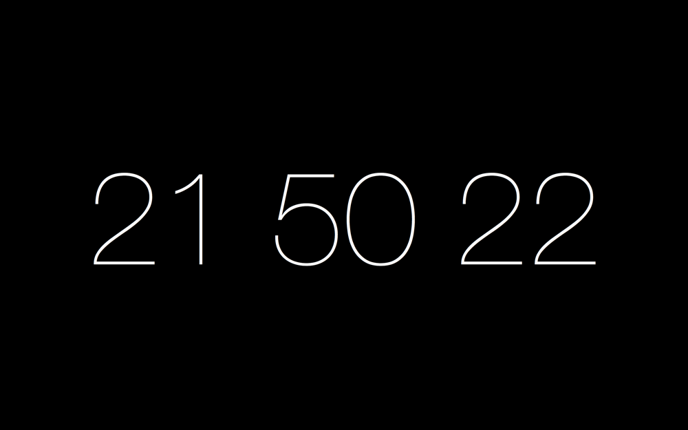
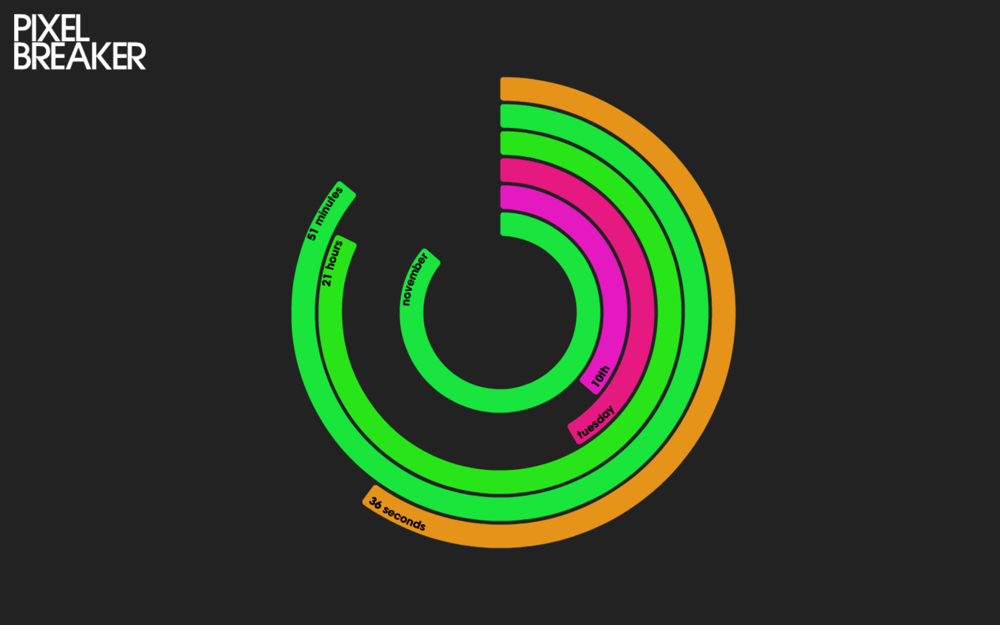
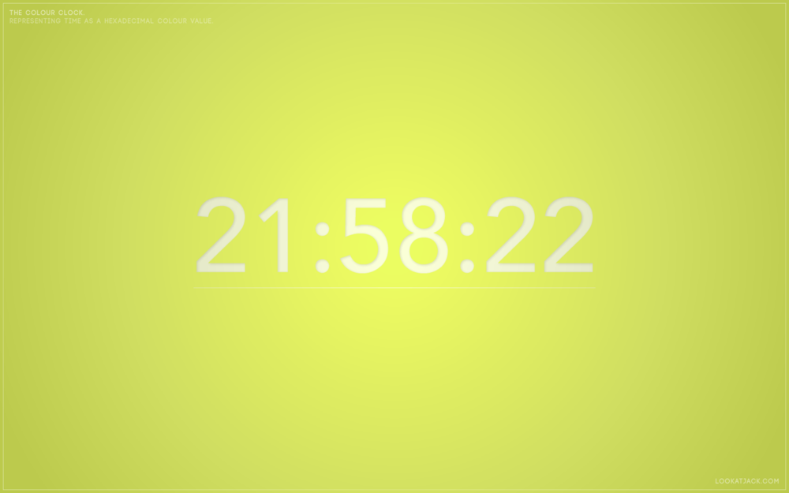
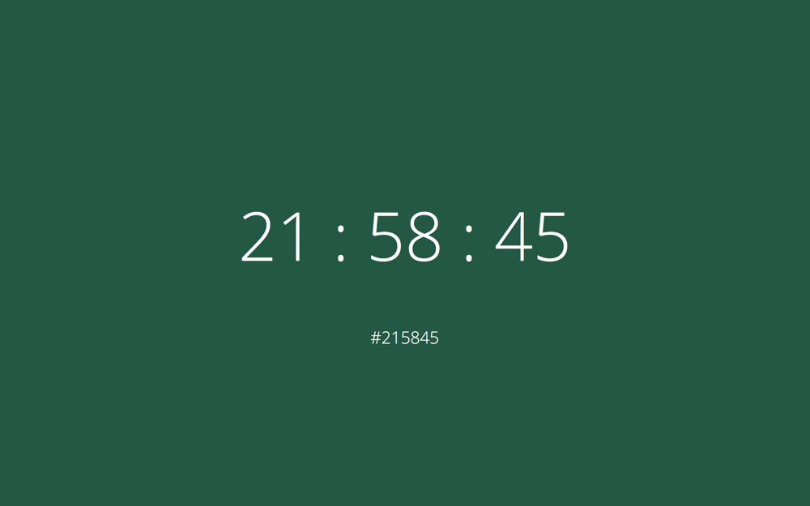
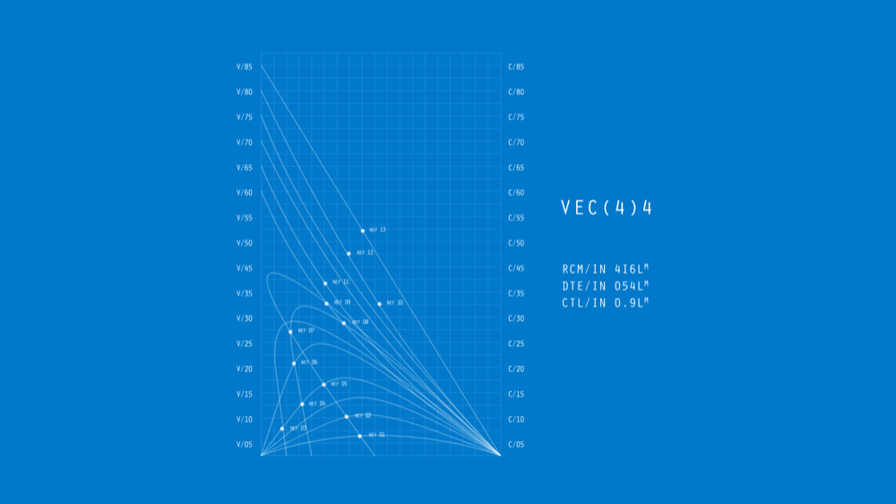

# Awesome OS X Screensavers [](https://github.com/sindresorhus/awesome)

> A curated list of screensavers for Mac OS X.

Inspired by the [awesome](https://github.com/sindresorhus/awesome) list thing.

## Table of Contents

- [Clocks](#clocks)
  - [Color Clocks](#color-clocks)
- [iOS (and Apple TV) Inspired](#ios-and-apple-tv-inspired)
- [Retro](#retro)
- [Sci-Fi](#sci-fi)
- [Video Game](#video-game)
- [Aquarium](#aquarium)
- [Developer](#developer)
- [Graphics](#graphics)
- [How to Get Screenshots](#how-to-get-screenshots)

---

## Clocks

### fliqlo

> A flip clock screensaver.

[](http://fliqlo.com/)

### Padbury Clock

> A very simple clock screensaver.

[](http://padbury.me/clock/)

### PolarClock

> A polar clock with the date.

[](http://blog.pixelbreaker.com/polarclock)

### Word Clock

> A clock made of words. It switches between a circular and a paragraph layout.

[](https://www.simonheys.com/wordclock/)

### Color Clocks

### Colour Clock

> Time as a hexadecimal colour value.

[](http://www.clock.lookatjack.com/)

### What Colour Is It?

> It's [http://whatcolourisit.scn9a.org/](http://whatcolourisit.scn9a.org/) but as a Mac screensaver.

[](https://github.com/Jonic/WhatColourIsIt-ScreenSaver)

## iOS (and Apple TV) Inspired

### Aerial

> Apple TV Aerial Screensaver for Mac.

[](https://github.com/JohnCoates/Aerial)

### Apple Watch

> A screensaver that looks like an Apple Watch.

[](http://www.rasmusnielsen.dk/applewatch/)

### iOS Lockscreen for OS X

> A screensaver that looks like the lockscreen on iPhone and iPad.

[](http://littleendiangamestudios.com/project/ios-7-screen-saver/)

## Retro

### PongSaver

> PongSaver is an OS X screensaver/clock which keeps time by using the score of a game of Pong. The left side wins once an hour, and the right side wins once a minute.

[](http://rogueamoeba.com/freebies/)

### Textify Me

> This interactive screen saver turns everything in front of your camera into text.

$0.99

[](https://itunes.apple.com/us/app/textify-me/id470453599)

## Sci-Fi

### HAL 9000

> From the movie 2001: A Space Odyssey.

Basic is free, advanced edition is $8.

[](http://www.halproject.com/)

### The Github Matrix Screensaver

> The latest commits from GitHub visualized in a Matrix-style animation.

[](https://github.com/winterbe/github-matrix-screensaver)

### StarWarsScroll

> Recreates the opening titles of the first 6 Star Wars movies.

[](http://download.cnet.com/StarWarsScroll-Screen-Saver/3000-2257_4-82580.html)

## Video Game

### SpeedS@ver

> Plays videos of people completing speed runs of games.

[](https://github.com/orta/SpeedS-ver)

## Aquarium

### Aquarium live lite

> Video of aquariums.

[](https://itunes.apple.com/us/app/aquarium-live-lite-relaxing/id462563503)

## Developer

### Developer Excuses

> A Mac OS X Screensaver which shows quotes from [http://developerexcuses.com](http://developerexcuses.com) (unofficial).

[](https://github.com/kimar/DeveloperExcuses)

## Graphics

### Electric Sheep Infinite Evolving Artwork

> Animations of evolving fractals.

$1.99

[](https://itunes.apple.com/us/app/electric-sheep-infinite-evolving/id444604503)

## How to Get Screenshots

Capture a screenshot with this command. You can change the 5 to adjust the number of seconds it waits to take the screenshot.

```
sleep 5; screencapture -m ~/Desktop/screenshots/image.png
```

Resize the image with this command. This will resize all png images in the screenshots directory.

```
sips -Z 1000 ~/Desktop/screenshots/*.png
```

## License

<a rel="license" href="http://creativecommons.org/licenses/by-sa/4.0/"></a><br />This work is licensed under a <a rel="license" href="http://creativecommons.org/licenses/by-sa/4.0/">Creative Commons Attribution-ShareAlike 4.0 International License</a>.
